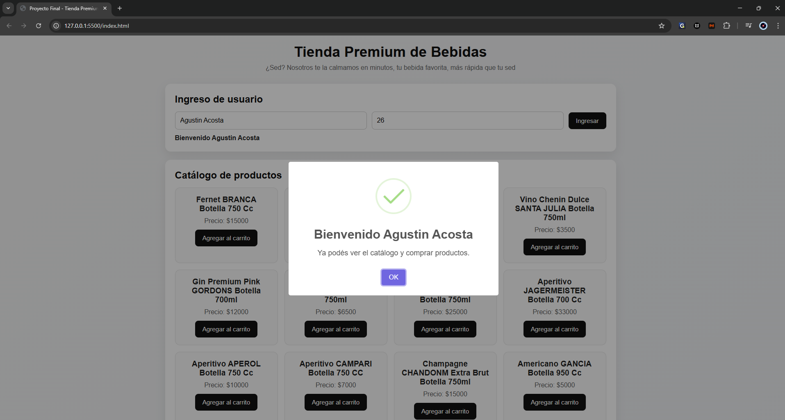

# Proyecto Final - Tienda Premium de Bebidas

## Descripción
Este proyecto consiste en un simulador interactivo de Ecommerce desarrollado en HTML, CSS y JavaScript.

La aplicación permite:
- ingresar un usuario validando mayoría de edad
- cargar productos desde un archivo JSON de forma asíncrona
- visualizar un catálogo generado dinámicamente desde JavaScript
- agregar productos al carrito
- manejar cantidades de productos
- calcular el total de la compra
- vaciar el carrito
- finalizar la compra
- guardar datos en localStorage
- visualizar historial de compras

## Tecnologías utilizadas
- HTML5
- CSS3
- JavaScript
- JSON
- SweetAlert2

## Funcionalidades principales
- Simulación completa del flujo de compra de un Ecommerce
- Render dinámico de productos
- Persistencia de datos con localStorage
- Interfaz interactiva con eventos
- Uso de librería externa para mejorar la experiencia del usuario

## Estructura del proyecto
- `index.html`
- `css/style.css`
- `js/main.js`
- `data/productos.json`

## Cómo ejecutar el proyecto
1. Descargar o clonar el repositorio
2. Abrir la carpeta del proyecto
3. Ejecutar `index.html` con Live Server o desde un entorno local

## Vista previa

## Autor
Agustin Acosta
